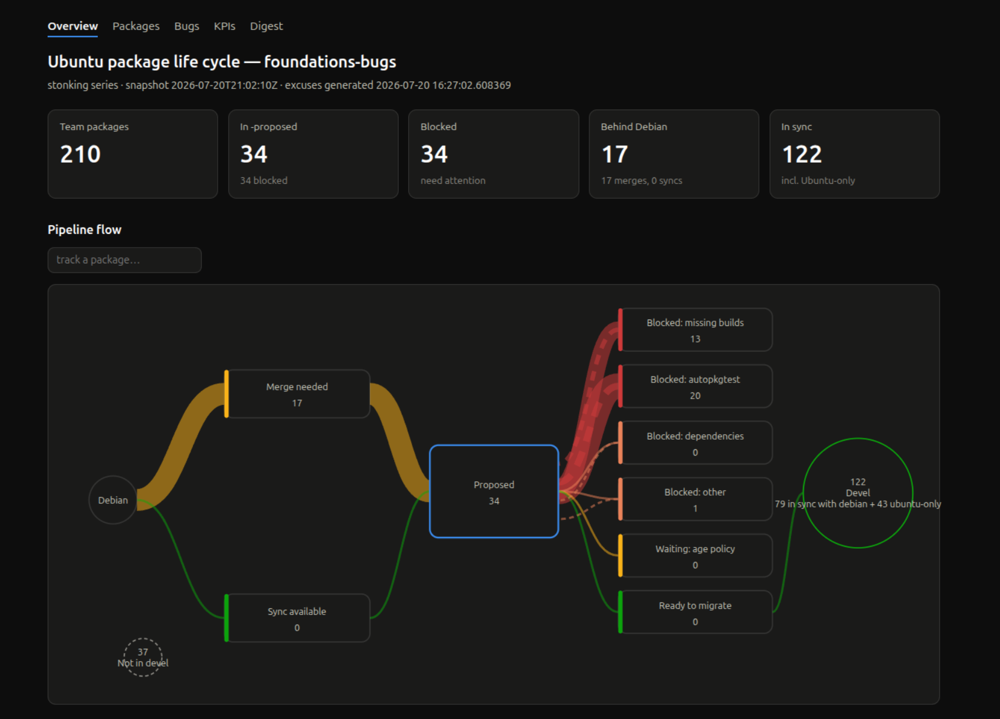

# uplc — Ubuntu Package Life Cycle

Observe where a team's Ubuntu packages sit in the development pipeline —
Debian delta, proposed-migration, blockers, bugs — **without hammering the
Launchpad API**. Built for the manager view: funnel counts, what's stuck,
where the biggest unblock opportunity is, where to press on bugs.

## How it works

Pipeline data comes from bulk artifacts the Ubuntu archive tooling already
publishes, fetched with conditional GETs (ETag / If-Modified-Since) into a
local cache:

| Question | Source |
|---|---|
| Which packages does my team own? | Launchpad `getBugSubscriberPackages` (one call per ingest; `package-team-mapping.json` as fallback — the public copy froze in May 2025) |
| Why is something stuck in -proposed? | `update_excuses.yaml.xz` (proposed-migration) |
| What version is where? | `Sources.xz` from archive.ubuntu.com (devel) and deb.debian.org (unstable) |
| Merge metadata | merges.ubuntu.com (optional; degrades to Sources comparison when unreachable) |
| Pending SRUs | `sru_report.yaml` from static-reports.ubuntu.com (optional, same ingress as merges.ubuntu.com — occasionally flaky, no VPN required; degrades to a bug-activity approximation when unreachable) |
| Team bugs | anonymous Launchpad API, watermarked (see below) |

Each ingest run snapshots every package's derived lifecycle state into
SQLite (`~/.local/share/uplc/uplc.db`) and records state transitions, so
time-in-state and per-day/week/month metrics accumulate locally — nothing
is ever re-scraped.

Bugs are the one sanctioned Launchpad API use, and it is deliberately
gentle: each `bugs-sync` runs **one** `searchTasks` query
(`structural_subscriber=<team>` + a `modified_since` watermark) and then
fetches exactly the bugs that search returned by ID through the same
conditional-GET cache — never per-package polling. The first sync is heavy
(every bug touched this year, whatever its status); every later sync is a
small increment. Bugs referenced by pipeline data (block-proposed /
update-excuse) are fetched by ID regardless of subscription.

## Usage

```console
$ python3 -m uplc ingest            # fetch + snapshot (run from cron/timer)
$ python3 -m uplc bugs-sync         # sync team bugs from Launchpad
$ python3 -m uplc digest -o digests # daily curated digest (LLM-narrated)
$ python3 -m uplc status            # funnel summary + proposed pipeline
$ python3 -m uplc stuck --days 7    # blocked items, oldest first
$ python3 -m uplc blockers          # migrations blocking the most packages
$ python3 -m uplc html -o dash      # static dashboard site (5 pages + feeds)
$ python3 -m uplc serve             # serve the dashboard on localhost
```

The dashboard is a self-contained static site (inline CSS/JS, no external
requests) with five interconnected pages:



- **index.html** — manager overview: tiles, a Debian → proposed-migration →
  Devel flow diagram (ribbon width and circle size scaled to the live
  snapshot counts, dashed retry loops for blocked states), proposed
  pipeline, biggest unblock opportunities. Every node in the flow links to
  the matching filtered view on packages.html; a search box above the
  diagram tracks one package's node directly (`#pkg=<name>`, shareable).
- **packages.html** — every team package with client-side filters (state,
  bug counts, time in state, free text) and sortable columns; each row
  expands to detail plus out-links (Launchpad, excuses, Debian tracker).
  Package names everywhere link here first (`#pkg-<name>`).
- **bugs.html** — bug prioritization: pipeline-gating bugs first, opened
  vs closed trend, a table of team packages with a pending SRU (verification
  status per bug, from the archive's `sru_report.yaml`), and a filterable
  table (open/closed, importance, untriaged, unassigned, stale, gating).
  Bug numbers always link to Launchpad. Filters are reflected in the URL
  hash, so filtered views are shareable (e.g. `bugs.html#q=glibc`).
- **kpi.html** — set-health metrics: package and bug percentages (in sync,
  blocked share, triaged, assigned, fix rate, concentration), daily/weekly/
  monthly rates of change, levels now vs 1/7/30 days ago, opened-vs-closed
  and open-backlog charts, and an SRU verification queue section (needs
  verification / verified / failed / removal-candidate counts, median age
  awaiting verification). Bug rates come from Launchpad's own dates and
  are complete immediately; pipeline rates count observed snapshot
  transitions and sharpen as ingest history accumulates.
- **digest.html** — blog-style archive of every daily digest, grouped by
  month, newest open. Subscribable: the site also writes `feed.json`
  (JSON Feed 1.1) and `feed.xml` (Atom) with the last 20 digests, so
  teammates can follow along in any feed reader. Pass
  `--base-url https://…` (or set `UPLC_BASE_URL`) once the site has a
  public URL so feed entries carry clickable permalinks.

## The daily digest

`uplc digest` turns one day's changes into a curated Markdown briefing:
bugs touched since the previous digest (with their fresh comments and
activity, fetched by ID through the same conditional-GET cache) plus
package lifecycle events derived from the snapshot history — uploads,
migrations, merges opened/resolved, FTBFS, new autopkgtest regressions,
and SRU events (entered -proposed, verified, verification failed,
removal-candidate, released) diffed from consecutive pending-SRU report
snapshots; falls back to an approximation from stable-series bug-task
changes only when that report was unreachable this run.

The narrative is written by an LLM invoked as a subprocess. The runner
contract is deliberately trivial so any model works: the command gets the
prompt as its last argument and the facts JSON on stdin, and must print
Markdown on stdout and exit 0. Default is `claude -p` (needs a prior
interactive `claude` login for the cron user); switch with `--llm-cmd` or
`UPLC_LLM_CMD` — e.g. `llm -m gpt-5 -s`, `gemini -p`, `ollama run
mistral`, or `contrib/llm-anthropic-api` (a ~30-line stdlib script hitting
the Anthropic HTTP API directly; copy it for any other vendor).
`UPLC_LLM_TIMEOUT` caps the run (default 300s).

The LLM never invents the record: it only sees a facts document, its
output is rejected if it cites bug numbers absent from the facts, and any
failure (offline, timeout, rejection, `--no-llm`) falls back to a
deterministic rendering of the same facts — a cron run always publishes
a digest. A typical crontab:

```crontab
17 6 * * *  uplc ingest && uplc bugs-sync && \
            uplc digest -o /srv/uplc/digests && \
            uplc html -o /srv/uplc/dash --base-url https://uplc.example.com
```

Order matters: `digest` reads the bugs-sync watermark (consecutive
digests tile exactly, no gaps or duplicates), and `html` runs last so
digest.html and the feeds include the new day.

Default team is `foundations-bugs`; use `--team` for any team in the
mapping. Only dependency beyond the standard library is PyYAML
(`python3-yaml`). Install as a command with `pip install -e .`.

Run the tests with `python3 -m unittest discover -s tests` — the Debian
version comparator is cross-checked against real `dpkg --compare-versions`.

## Lifecycle states

```
blocked-build      missing builds / FTBFS in -proposed
blocked-tests      autopkgtest regressions
blocked-depends    waiting on another package's migration
blocked-other      freeze block, block bug, ...
waiting-age        only waiting for the age policy
ready-to-migrate   valid candidate, migrates on next britney run
merge-needed       Debian is newer, Ubuntu delta to remerge
sync-available     Debian is newer, no Ubuntu delta
ubuntu-only        no Debian counterpart
in-sync            devel is current vs Debian unstable
not-in-devel       subscribed package absent from the devel series
```

## Caveats

- "Seen"/stuck ages are measured from local observation history; they
  mature as ingest runs accumulate (there is no retroactive backfill for
  pipeline state).
- The excuses file and archive indexes are generated at different times;
  a migration completed in between is detected via version comparison.
- Debian comparison uses unstable main only.
- Bug sync is anonymous, so private bugs are invisible. Bugs with no
  activity since 2026-01-01 are out of scope by design — even ones still
  open. The team's dormant backlog is huge and isn't actionable signal;
  scope is "touched this year", not "all open ever".

## Roadmap

- **Sponsorship queue** annotations.
- **Trend views**: per-day/week/month rollups over the snapshot history.
